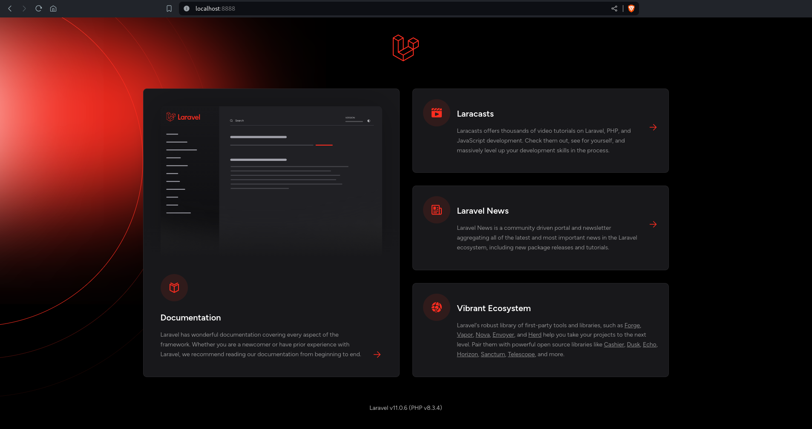

<div style="width:100%;float:left;clear:both;margin-bottom:50px;">
    <a href="https://github.com/pabloripoll?tab=repositories">
        
    </a>
</div>

<div style="width:100%;float:left;clear:both;margin-bottom:50px;">
    <a href="resources/doc/laravel-11-screenshot.png">
        
    </a>
</div>

# Docker Laravel 11 with PHP FPM 8.3

The objective of this repository is having a CaaS [Containers as a Service](https://www.ibm.com/topics/containers-as-a-service) to provide a start up application with the basic enviroment features to deploy a php service running with Nginx and PHP-FPM in a container for [Laravel](https://laravel.com/) and another container with a MySQL database to follow the best practices on an easy scenario to understand and modify on development requirements.

The connection between container is as [Host Network](https://docs.docker.com/network/drivers/host/) on `eth0`, thus both containers do not share networking or bridge configuration.

As client end user both services can be accessed through `localhost:${PORT}` but the connection between containers is through the `${HOSTNAME}:${PORT}`.

### Backend Container Service

- [Laravel 11](https://laravel.com/docs/11.x/releases)
- [PHP-FPM 8.3](https://www.php.net/releases/8.3/en.php)
- [Nginx 1.24](https://nginx.org/)
- [Alpine Linux 3.19](https://www.alpinelinux.org/)

### Database Container Service

This project does not include a database service for it is intended to connect to a database instance like in a cloud database environment or similar.

To emulate a SQL database service it can be used the following [MariaDB 10.11](https://mariadb.com/kb/en/changes-improvements-in-mariadb-1011/) repository:
- [https://github.com/pabloripoll/docker-mariadb-10.11](https://github.com/pabloripoll/docker-mariadb-10.11)

### Frontend Container Service

- [NodeJS 22.2](https://nodejs.org/en/download/package-manager)
- [Nginx 1.24](https://nginx.org/)
- [Alpine Linux 3.20](https://www.alpinelinux.org/)

### Project objetives with Docker

* Built on the lightweight and secure Alpine 3.19 [2024 release](https://www.alpinelinux.org/posts/Alpine-3.19.1-released.html) Linux distribution
* Multi-platform, supporting AMD4, ARMv6, ARMv7, ARM64
* Very small Docker image size (+/-40MB)
* Uses PHP 8.3 as default for the best performance, low CPU usage & memory footprint, but also can be downgraded till PHP 8.0
* Optimized for 100 concurrent users
* Optimized to only use resources when there's traffic (by using PHP-FPM's `on-demand` process manager)
* The services Nginx, PHP-FPM and supervisord run under a project-privileged user to make it more secure
* The logs of all the services are redirected to the output of the Docker container (visible with `docker logs -f <container name>`)
* Follows the KISS principle (Keep It Simple, Stupid) to make it easy to understand and adjust the image to your needs
* Services independency to connect the application to other database allocation

#### PHP config

To use a different PHP 8 version the following [Dockerfile](infrastructure/nginx-php/infrastructure/Dockerfile) arguments and variable has to be modified:
```Dockerfile
ARG PHP_VERSION=8.3
ARG PHP_ALPINE=83
...
ENV PHP_V="php83"
```

Also, it has to be informed to [Supervisor Config](infrastructure/nginx-php/infrastructure/config/supervisord.conf) the PHP-FPM version to run.
```bash
...
[program:php-fpm]
command=php-fpm83 -F
...
```

## Dockerfile insight
```
# Install main packages and remove default server definition
RUN apk add --no-cache \
  curl \
  wget \
  nginx \
  curl \
  zip \
  bash \
  vim \
  git \
  supervisor

RUN set -xe \
    && apk add --no-cache --virtual .build-deps \
        libzip-dev \
        freetype-dev \
        icu-dev \
        libmcrypt-dev \
        libjpeg-turbo-dev \
        libpng-dev \
        libxslt-dev \
        patch \
        openssh-client

# Install PHP and its extensions packages and remove default server definition
ENV PHP_V="php83"

RUN apk add --no-cache \
  ${PHP_V} \
  ${PHP_V}-cli \
  ${PHP_V}-ctype \
  ${PHP_V}-curl \
  ${PHP_V}-dom \
  ${PHP_V}-fileinfo \
  ${PHP_V}-fpm \
  ${PHP_V}-gd \
  ${PHP_V}-intl \
  ${PHP_V}-mbstring \
  ${PHP_V}-opcache \
  ${PHP_V}-openssl \
  ${PHP_V}-phar \
  ${PHP_V}-session \
  ${PHP_V}-tokenizer \
  ${PHP_V}-soap \
  ${PHP_V}-xml \
  ${PHP_V}-xmlreader \
  ${PHP_V}-xmlwriter \
  ${PHP_V}-simplexml \
  ${PHP_V}-zip \
  # Databases
  ${PHP_V}-pdo \
  ${PHP_V}-pdo_sqlite \
  ${PHP_V}-sqlite3 \
  ${PHP_V}-pdo_mysql \
  ${PHP_V}-mysqlnd \
  ${PHP_V}-mysqli \
  ${PHP_V}-pdo_pgsql \
  ${PHP_V}-pgsql \
  ${PHP_V}-mongodb \
  ${PHP_V}-redis

# PHP Docker
RUN docker-php-ext-install pdo pdo_mysql gd

# PHP PECL extensions
RUN apk add \
  ${PHP_V}-pecl-amqp \
  ${PHP_V}-pecl-xdebug
```

## Directories Structure

Directories and main files on a tree architecture description. The `/infrastructure` directory has `/nginx-php` directory separated in case of needing to be included other container service directory with its specific contents
```
.
│
├── infrastructure
│   │
│   ├── nginx-php
│   │   ├── docker
│   │   │   ├── config
│   │   │   ├── .env
│   │   │   ├── docker-compose.yml
│   │   │   └── Dockerfile
│   │   │
│   │   └── Makefile
│   │
│   └── (other...)
│
├── resources
│   │
│   ├── database
│   │   ├── mariadb-init.sql
│   │   └── mariadb-backup.sql
│   │
│   ├── doc
│   │   └── (any documentary files...)
│   │
│   └── backend
│       └── (any file or directory required for start-up or re-building the app...)
│
├── backend
│   └── (Laravel application...)
│
├── .env
├── .env.example
└── Makefile
```

## Automation with Makefile

Makefiles are often used to automate the process of building and compiling software on Unix-based systems as Linux and macOS.

*On Windows - I recommend to use Makefile: \
https://stackoverflow.com/questions/2532234/how-to-run-a-makefile-in-windows*

Makefile recipies
```bash
$ make help
usage: make [target]

targets:
Makefile  help                    shows this Makefile help message
Makefile  hostname                shows local machine ip
Makefile  fix-permission          sets project directory permission
Makefile  host-check              shows this project ports availability on local machine
Makefile  project-set             sets the project enviroment file to build the container
Makefile  project-create          creates the project container from Docker image
Makefile  project-start           starts the project container running
Makefile  project-stop            stops the project container but data won't be destroyed
Makefile  project-destroy         removes the project from Docker network destroying its data and Docker image
Makefile  backend-ssh             enters the backend container shell
Makefile  backend-update          updates the backend set version into container
Makefile  database-install        installs into container database the init sql file from resources/database
Makefile  database-replace        replaces container database with the latest sql backup file from resources/database
Makefile  database-backup         creates / replace a sql backup file from container database in resources/database
Makefile  repo-flush              clears local git repository cache specially to update .gitignore
Makefile  repo-commit             echoes common git commands
```

## Service Configuration

Create a [DOTENV](.env) file from [.env.example](.env.example) and setup according to your project requirement the following variables
```
# REMOVE COMMENTS WHEN COPY THIS FILE

# Leave it empty if no need for sudo user to execute docker commands
DOCKER_USER=sudo

# Container data for docker-compose.yml
PROJECT_NAME="PR PROJECT"       # <- this name will be prompt for automation commands
PROJECT_ABBR="pr-proj"          # <- part of the service image tag - useful if similar services are running
PROJECT_HOST="127.0.0.1"        # <- for this project is not necessary

FRONTEND_IMGK="-nxjs"               # <- container image key to manage docker image created
FRONTEND_PORT="8890"                # <- local machine port opened for container service
FRONTEND_CAAS="proj-front"          # <- container name to build the service
FRONTEND_BIND="../../../frontend"   # <- path where application is binded from container to local

BACKEND_IMGK="-nxphp"               # <- container image key to manage docker image created
BACKEND_PORT="8891"                 # <- local machine port opened for container service
BACKEND_CAAS="proj-back"            # <- container name to build the service
BACKEND_BIND="../../../backend"     # <- path where application is binded from container to local

DATABASE_IMGK="-mdb"                # <- container image key to manage docker image created
DATABASE_PORT="8892"                # <- local machine port opened for container service
DATABASE_CAAS="proj-mariadb"        # <- container name to build the service
DATABASE_ROOT="eYVX7EwVmmxKPCD"     # <- mariadb root password
DATABASE_NAME="mariadb"             # <- mariadb database name
DATABASE_USER="mariadb"             # <- mariadb database user
DATABASE_PASS="123456"              # <- mariadb database password
DB_BACKUP_NAME="mariadb"            # <- the name of the database backup or copy file
DB_BACKUP_PATH="resources/database" # <- path where database backup or copy resides
```

*(Database service container is explained [below](https://github.com/pabloripoll/docker-symfony-6-php-fpm-8?tab=readme-ov-file#custom-database-service-usage))*

Exacute the following command to create the [infrastructure/nginx-php/.env](infrastructure/nginx-php/.env) file, required for building the container
```bash
$ make backend-set

PR PROJECT - LARAVEL 11 docker-compose.yml .env file has been set.
```

Checkout port availability from the set enviroment
```bash
$ make host-check

Checking configuration for PR PROJECT - LARAVEL 11 container:
PR PROJECT - LARAVEL 11 > port:8888 is free to use.
```

Checkout local machine IP to set connection between container services using the following makefile recipe if required
```bash
$ make hostname

192.168.1.41
```

## Create the application container service

For this repository only backend service automation is set
```bash
$ make project-create
```

If is needed to create other infrastucture containers, update the root [Makefile](Makefile)
```Makefile
host-check: ## shows this project ports availability on local machine
	cd infrastructure/mariadb && $(MAKE) port-check
	cd infrastructure/nginx-php && $(MAKE) port-check
	cd infrastructure/nodejs-angular && $(MAKE) port-check

project-set: ## sets the project enviroment file to build the container
	cd infrastructure/mariadb && $(MAKE) env-set
	cd infrastructure/nginx-php && $(MAKE) env-set
	cd infrastructure/nodejs-angular && $(MAKE) env-set

project-create: ## creates the project container from Docker image
	cd infrastructure/mariadb && $(MAKE) env-set build up
	cd infrastructure/nginx-php && $(MAKE) env-set build up
	cd infrastructure/nodejs-angular && $(MAKE) env-set build up

project-start: ## starts the project container running
	cd infrastructure/mariadb && $(MAKE) start
	cd infrastructure/nginx-php && $(MAKE) start
	cd infrastructure/nodejs-angular && $(MAKE) start

project-stop: ## stops the project container but data won't be destroyed
	cd infrastructure/mariadb && $(MAKE) stop
	cd infrastructure/nginx-php && $(MAKE) stop
	cd infrastructure/nodejs-angular && $(MAKE) stop

project-destroy: ## removes the project from Docker network destroying its data and Docker image
	cd infrastructure/mariadb && $(MAKE) clear destroy
	cd infrastructure/nginx-php && $(MAKE) clear destroy
	cd infrastructure/nodejs-angular && $(MAKE) clear destroy
```

## Project Service

If the container is built with the pre-installed application content, by browsing to localhost with the selected port configured [http://localhost:8891/](http://localhost:8891/) will display the successfully installation welcome page.

The pre-installed application dependencies requires to updated on any creation. The following Makefile recipe will update dependencies set on `composer.json` file

```bash
$ make backend-update
```

Also can be performed by
```bash
$ cd infrastructure/nginx-php
$ make app-update
```

If it is needed to build the container with other type of application configurations from base, there is a Makefile recipe to set at [infrastructure/Makefile](infrastructure/Makefile) all the commands needed for its installation.

```bash
$ cd infrastructure/nginx-php
$ make app-install
```

## Container Information

Docker image size example
```bash
$ sudo docker images
REPOSITORY   TAG           IMAGE ID       CREATED         SIZE
laravel-app  lara...       373f6967199b   5 minutes ago   251MB
```

Stats regarding the amount of disk space used by the container example
```bash
$ sudo docker system df
TYPE            TOTAL     ACTIVE    SIZE      RECLAIMABLE
Images          1         1         251.4MB   0B (0%)
Containers      1         1         4B        0B (0%)
Local Volumes   1         0         117.9MB   117.9MB (100%)
Build Cache     39        0         10.56kB   10.56kB
```

## Stopping the Container Service

Using the following Makefile recipe stops application from running, keeping database persistance and application files binded without any loss
```bash
$ make backend-stop
```

## Removing the Container Image

To remove application container from Docker network use the following Makefile recipe *(Docker prune commands still needed to be applied manually)*
```bash
$ make backend-destroy
```

Prune Docker system cache
```bash
$ sudo docker system prune
```

Prune Docker volume cache *(if a database was created)*
```bash
$ sudo docker volume prune
```

## Backend Service Check

There are two PHP files on [resources/backend](resources/backend) with same structure as application to replace or add a predifined example to test the service.

It can be used an API platform service *(Postman, Firefox RESTClient, etc..)* or just browsing the following endpoints to check connection with Laravel.

Check-out a basic service check
```
GET: http://localhost:8891/api/v1/health

{
    "status": true
}
```

Check connection to database through this endpoint. If conenction params are not set already or does not exist, endpoint response will be as follow
```
GET: http://localhost:8891/api/v1/health/db

{
    "status": false,
    "message": "Connect to database failed - Check connection params.",
    "error": {
        "errorInfo": [
            "HY000",
            2002,
            "Host is unreachable"
        ]
    }
}
```

When a proper connection is set, endpoint will response as follow
```
GET: http://localhost:8891/api/v1/health/db

{
    "status": true
}
```

## Database

This repository comes with an initialized .sql with a main database user. See [.env.example](.env.example)

Every time the containers are built up and running it will be like start from a fresh installation.

You can continue using this repository with the pre-set database executing the command `$ make database-install`

Follow the next recommendations to keep development stages clear and safe.

*On first installation* once the app service is running with basic tables set, I suggest to make a initialization database backup manually, saving as [resources/database/mariadb-backup.sql](resources/database/mariadb-backup.sql) but renaming as [resources/database/mariadb-init.sql](resources/database/mariadb-init.sql) to have that init database for any Docker compose rebuild / restart on next time.

**The following three commands are very useful for *Continue Development*.**

### DB Install

If it is needed to restart the project from base installation step, you can use the init database .sql file to restart at that point in time. Although is not common to use, helps to check and test installation health.
```bash
$ make database-install

PR PROJECT - DATABASE has been installed.
```

### DB Backup

When the project is already in an advanced development stage, making a backup is recommended to keep lastest database registers.
```bash
$ make database-backup

PR PROJECT - DATABASE backup has been created.
```

### DB Replace

Replace the database set on container with the latest .sql backup into current development stage.
```bash
$ make database-replace

PR PROJECT - DATABASE has been replaced.
```

#### Notes

- Notice that both files in [resources/database/](resources/database/) have the name that has been set on the main `.env` file to automate processes.

- Remember that on any change in the main `.env` file will be required to execute the following Makefile recipe
```bash
$ make project-set

PR PROJECT - BACKEND docker-compose.yml .env file has been set.
```

## Connection between containers

#### On Windows systems

This project has not been tested on Windows OS neither I can use it to test it. So, I cannot bring much support on it.

Anyway, using this repository you will needed to find out your PC IP by login as an `administrator user` to set connection between containers.

```bash
C:\WINDOWS\system32>ipconfig /all

Windows IP Configuration

 Host Name . . . . . . . . . . . . : 191.128.1.41
 Primary Dns Suffix. . . . . . . . : paul.ad.cmu.edu
 Node Type . . . . . . . . . . . . : Peer-Peer
 IP Routing Enabled. . . . . . . . : No
 WINS Proxy Enabled. . . . . . . . : No
 DNS Suffix Search List. . . . . . : scs.ad.cs.cmu.edu
```

Take the first ip listed. Wordpress container will connect with database container using that IP.

#### On Unix based systems

Find out your IP on UNIX systems and take the first IP listed
```bash
$ hostname -I

191.128.1.41 172.17.0.1 172.20.0.1 172.21.0.1
```
